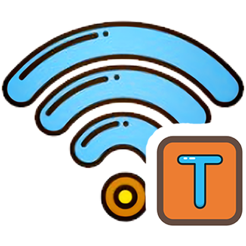
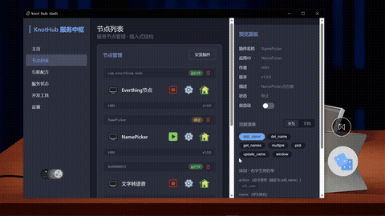
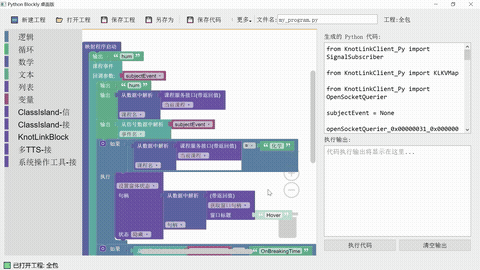
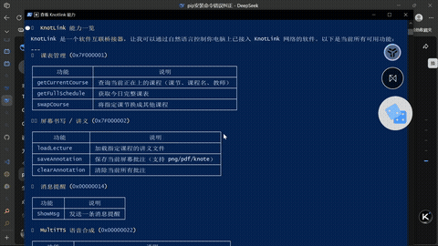
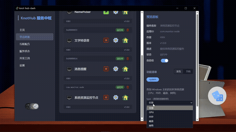
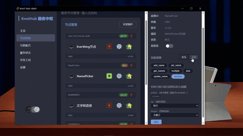
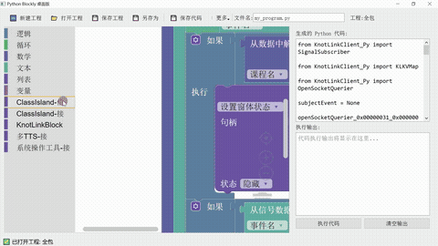

  

# KnotLink 协议+周边

为所有软件的对话，打一个理解的结

KnotLink 是一款轻量化、语义化应用间互联通信协议。

它拥有完善的基础库、丰富的配套软件及辅助工具，旨在简化通讯流程，降低联动门槛，扩大互联范围，为开发者提供一套简洁而完备的应用互联解决方案。

#### [官方网站](https://knotlink.cn/) | [项目文档](https://knotlink.cn/docs/intro) | [程序安装](https://knotlink.cn/docs/intro) | [接入者列表](https://knotlink.cn/docs/node-and-recipe-index/overview) | [配方共享平台](https://knotlink.cn/docs/node-and-recipe-index/overview)

# 这些软件支持KnotLink

  
  &nbsp;&nbsp;
  
  &nbsp;&nbsp;
  
  &nbsp;&nbsp;
  
  &nbsp;&nbsp;
  
  &nbsp;&nbsp;
  
  &nbsp;&nbsp;
  
  &nbsp;&nbsp;
  
  &nbsp;&nbsp;
  
  &nbsp;&nbsp;
  

# KnotLink包含

基础库：提供”发布-订阅”，”询问-回复‘’模式库、KLUDF消息体标准化库

功能清单：应用定义一套功能清单，对外声明能力（包含接口与信号）

辅助工具：KnotHub、KnotToolChain、配方编辑器

> [!TIP]
>
> 您可以查看 [KnotLink 文档](https://knotlink.cn/docs/intro) 了解更多。

# 当你有了 KnotLink，可以

| 应用无缝协作 | 零代码自动化 | AI Agent 无缝调用 |
|:----------:|:----------:|:----------------:|
|  |  |  |

# KnotLink 可以帮你自动生成

| 图形化接口调试界面 | 简洁易懂的接口文档 |
|:----------------:|:----------------:|
|  |  |

| 多种语言的调用 SDK | 低代码调用块、节点 |
|:----------------:|:----------------:|
|  |  |

# KnotLink 生态

| 项目 | 定位 | 链接 |
|------|------|------|
| **KnotLinkSDK** | 协议核心，提供接入 SDK | [仓库](https://github.com/KnotLink-Protocol/KnotLinkSDK) |
| **KnotHub** | 节点管理与调度中心 | [仓库](https://github.com/KnotLink-Protocol/KnotHub) |
| **KNodeIndex** | 节点发现与索引服务 | [仓库](https://github.com/KnotLink-Protocol/KNodeIndex) |

# 如何使用KnotLink

> [!WARNING]
> 
>不论你是谁，使用 KnotLink 及其配套应用前，**请务必安装 KnotLinkService**，这是 KnotLink 核心服务。

> [!IMPORTANT]
> 
>推荐安装 **KnotHub** 一站式平台，它提供了图形界面节点管理、自动化配方管理、配方编辑、节点调试、文档生成等功能，并附带工具链。

## 我是普通用户

#### 调用一个功能试试

打开KnotHub，切换节点列表选项卡，选择一个你心仪的应用，点击它，在”预览窗格”下方“的”交互“页面可尝试调用其功能。

详情参考文档

#### 自动化配方（互联配方）

##### 下载配方

##### 编辑配方

打开Knothub，切换到互联配方选项卡，点击新建配方，编辑你的配方吧。

详情参考文档

#### 试试氛围编程

你可以想AI描述你的感觉，无需编程基础，它便可以按照你的想法联动软件。

详情参考文档

## 我是开发者
> [!IMPORTANT]
> 
>开始开发前，请下载KnotLinkSDK以及KnotLink库（部分语言）。

### 我想调用

#### 在KnotHub上查看并试调用功能

#### 在代码中静态调用

#### 在代码中动态调用

### 我想接入

#### 免重构，微创引入KnotLink

#### 工具链，图形化调试接口

#### 上线，成为一个KnotLink节点

# 致谢

## 感谢这些同学对KnotLink的贡献

## 特别致谢

### 感谢项目初期同学、好友的支持

感谢MineBackup及FolderRewind项目以及他们的作者Leafuke，是你在项目初期与KnotLink主创合作调试、完善规范、贡献代码、给予鼓励，助力项目走向成熟。

感谢胡钰松、ColorfulLcat、温谨WenJin，在项目初期合作调试并给予建议。

感谢MineBackup、FolderRewind项目在KnotLink冷启动期信任并接入KnotLink。

感谢NamePicker、InkCanvas提供fork，接入KnotLink，成为初始节点。

### 本项目使用了如下开源框架、库、项目

# 加入生态

KnotLink 是一个开源项目，欢迎所有开发者参与共建：

* **为你的软件接入 KnotLink** — 让你的作品融入更大的生态
* **创建并分享互联配方** — 帮助更多人实现自动化
* **贡献代码或文档** — 一起完善这个协议

**让软件不再孤岛，让连接自然发生。**

---

## 有关链接

* GitHub：`github.com/KnotLink-Protocol`
* 文档：`knotlink.cn`

*KnotLink —— 软件互联，本该如此简单。*
