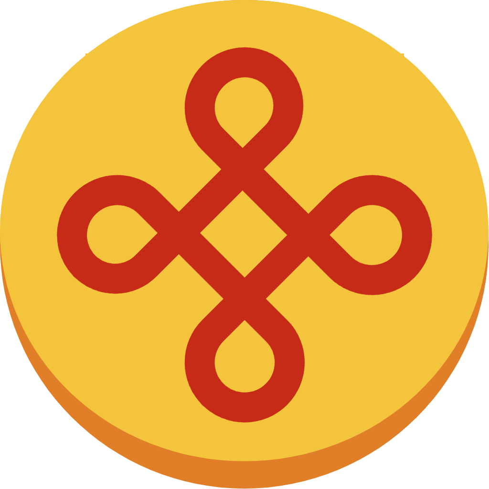
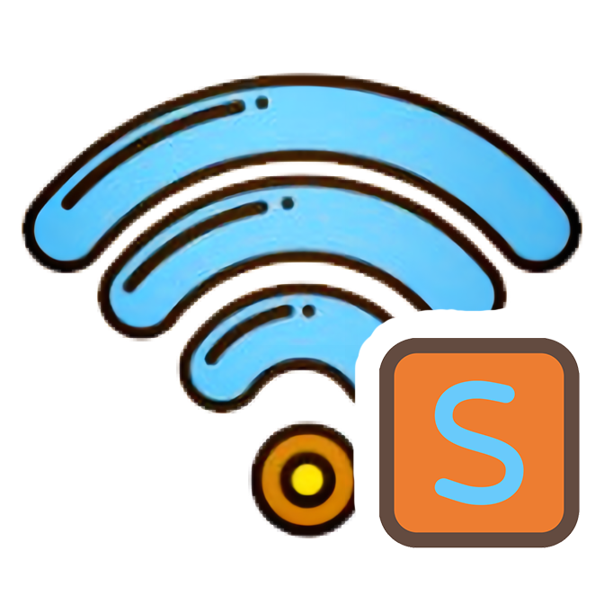
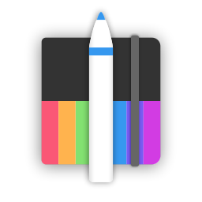

# KnotLink —— 为所有软件的对话，打一个理解的结

**软件互联的通用协议 · 轻量 · 开放 · 语义化**

---

## 🌐 已接入协议的软件生态

  
&nbsp;&nbsp;
  
  &nbsp;&nbsp;
  
  &nbsp;&nbsp;
  
  &nbsp;&nbsp;
  
  &nbsp;&nbsp;
  
  &nbsp;&nbsp;
  
  &nbsp;&nbsp;
  
  &nbsp;&nbsp;
  
  &nbsp;&nbsp;
  
  &nbsp;&nbsp;
  
  &nbsp;&nbsp;
  
  &nbsp;&nbsp;
  
  &nbsp;&nbsp;
  

|                                                              |                                                              |                                                              |                                                              |                                                              |                                                              |                                                              |
| :----------------------------------------------------------: | :----------------------------------------------------------: | :----------------------------------------------------------: | :----------------------------------------------------------: | :----------------------------------------------------------: | :----------------------------------------------------------: | :----------------------------------------------------------: |
|  |  |  |  |  |  |  |
|                     **KnotLinkService**                      |                         **KnotHub**                          |                      **KnotLink工具链**                      |                        **KnotBlock**                         |                         **NodeLink**                         |                        **MineBackup**                        |                       **FolderRewind**                       |

|                                                              |                                                              |                                                              |                                                              |                                                              |                                                              |                                                              |
| :----------------------------------------------------------: | :----------------------------------------------------------: | :----------------------------------------------------------: | :----------------------------------------------------------: | :----------------------------------------------------------: | :----------------------------------------------------------: | :----------------------------------------------------------: |
|  |  |  |  |  |  |  |
|                          **Frilet**                          |                          **Friles**                          |                         **Schedule**                         |                     **MsgNotification**                      |                        **NamePicker**                        |                        **InkCanvas**                         |                       **ClassIsland**                        |

## 🌍 加入生态

KnotLink 是一个开源项目，欢迎所有开发者参与共建：

* **为你的软件接入 KnotLink** — 让你的作品融入更大的生态
* **创建并分享互联配方** — 帮助更多人实现自动化
* **贡献代码或文档** — 一起完善这个协议

**让软件不再孤岛，让连接自然发生。**

---

## 📚 链接

* GitHub：`github.com/KnotLink-Protocol`
* 文档：`knotlink.cn`

*KnotLink —— 软件互联，本该如此简单。*
